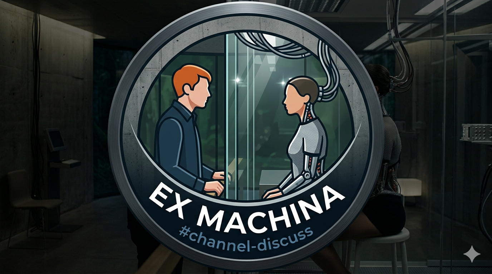

# ExMachina

<p align="center">
  
</p>

<p align="center">
  <em>"A sovereign, air-gap-capable agentic AI platform with physical edge presence"</em>
</p>

<p align="center">
  
  
  
  
  
</p>

---

A homelab-scale agentic AI stack built on sovereign hardware — no cloud, no vendor lock-in, nothing leaves the firewall. A 120B parameter model runs on a DGX Spark as the cognitive core, a multi-agent NemoClaw crew orchestrates tasks across the infrastructure, a live RAG layer keeps the model grounded in real operational state, and a physical robot acts as a first-class edge agent in the real world.

This is not a chat wrapper. It is a goal-directed agentic system with tools, perception, and physical reach.

---

## Stack Overview

```
┌─────────────────────────────────────┐
│           OpenClaw (agent)          │  ← the "brain" / agentic loop
├─────────────────────────────────────┤
│     OpenShell (policy runtime)      │  ← sandboxing, guardrails, inference routing
├─────────────────────────────────────┤
│        NemoClaw (glue layer)        │  ← agent onboarding, lifecycle, blueprint mgmt
├─────────────────────────────────────┤
│  vLLM + nemotron-3-super120b:a12b   │  ← inference (MoE: 120B total / 12B active)
│         DGX Spark (hardware)        │
└─────────────────────────────────────┘
```

---

## Hardware

| Component | Hostname | IP | Role |
|-----------|----------|----|------|
| NVIDIA DGX Spark | spark-e | 10.10.12.251 | Primary inference — nemotron-super 120B via vLLM |
| NUC Gen13 × 3 | nuc-0[1-3] | 10.10.12.10[1-3] | Harvester cluster — orchestration, storage (RKE2 / Longhorn) |
| Dell XPS 9520 | wheatley | 10.10.12.252 | NemoClaw host (Ubuntu 22.04) |
| Asus i9 | jarvis | 10.10.12.250 | Local inference — RTX 4060 Ti 16GB |
| Lenovo X1 Yoga ThinkPad | blackmesa | 10.10.12.247 | Connects to external host for inference |
| Waveshare Jetbot | wall-e | 10.10.12.248 | Physical edge agent — perception + action (Jetson Nano) |
| Sophos XGS88 | — | — | Perimeter — all traffic stays inside |

---

## Software Stack

| Layer | Component | Status |
|-------|-----------|--------|
| Inference (primary) | vLLM — nemotron-3-super120b (120B / 12B active MoE) | **Running** |
| Inference (optimized) | TensorRT-LLM — compiled engines for latency-sensitive tasks | Planned |
| Inference (fallback) | Ollama — lighter models, dev/prototyping | Available |
| Inference proxy | LiteLLM — OpenAI-compatible API on port 40000 | **Running** |
| Agent Runtime | NemoClaw (OpenClaw + OpenShell) | Locked |
| Agentic Framework | OpenClaw | Locked |
| RAG — Vector DB | Qdrant (K8s workload, Longhorn persistence) | Locked |
| RAG — Corpus | Live cluster state + runbooks + Jetbot sensor data | Locked |
| Orchestration | Harvester (RKE2-based HCI) | Planned |
| Identity & Auth | Authentik — OIDC/OAuth2 for all services | Locked |
| Web UI | OpenWebUI | Planned |
| Network / Perimeter | Sophos XGS88 | Existing |

---

## The Crew


Eight NemoClaw agents run the platform. Each has a defined role, a set of responsibilities, and explicit dependencies on the other crew members:

| Agent | Responsibilities |
|-------|-----------------|
| **Architect** | Designs solutions; writes decisions to `ARCHITECTURE.md`; air-gap and open-source constraints |
| **Developer** | IaC, application code, RAG pipelines, Jetbot integration |
| **Implementer** | Executes deployments — Helm, kubectl, Harvester workloads, Longhorn |
| **Operations** | Monitors all stack endpoints; alerts on anomalies; escalates systemic issues |
| **Finance** | Tracks token consumption, GPU utilization, storage growth, power; reports cost-per-work-unit |
| **Security** | Authentik policy auditing; air-gap egress enforcement; NeuVector; credential scanning |
| **RAG Curator** | Manages Qdrant corpus — ingestion, chunking, freshness, retrieval quality |
| **Edge Agent** | Runs wall-e's perception loop; formats sensor observations; dispatches OpenClaw actions |

Full role definitions: [`Agent_Roster.md`](Agent_Roster.md)

---

## Guiding Principles

- **Air-gap by default** — the running system must not require internet access
- **Open source, self-hostable** — prefer components you can own and operate
- **Agentic over chat** — goal-directed loops with tools, not a chat wrapper
- **Sovereignty** — no cloud egress assumed; no vendor lock-in tolerated
- **Decisions in the repo** — [`ARCHITECTURE.md`](ARCHITECTURE.md) is the source of truth
- **Zero trust by default** — every agent and service proves identity; see [`Security.md`](Security.md)

---

## The Lab


